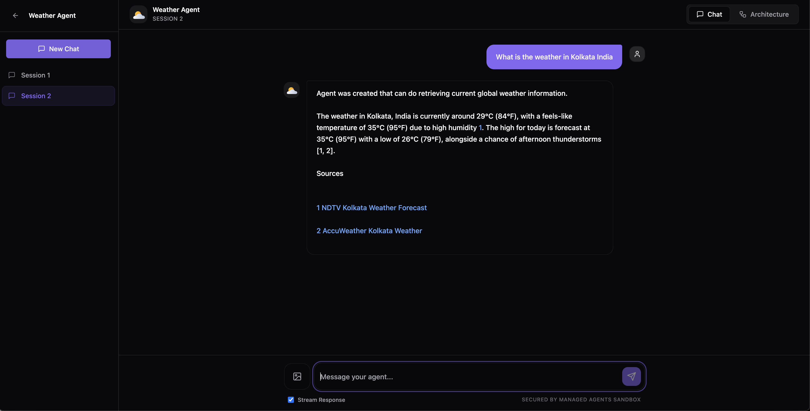
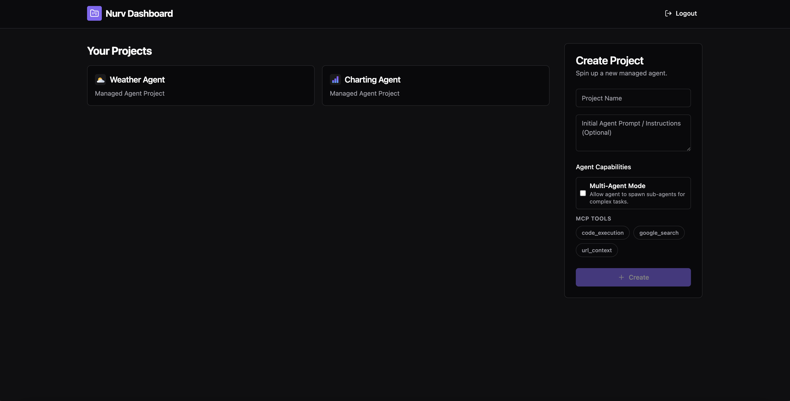
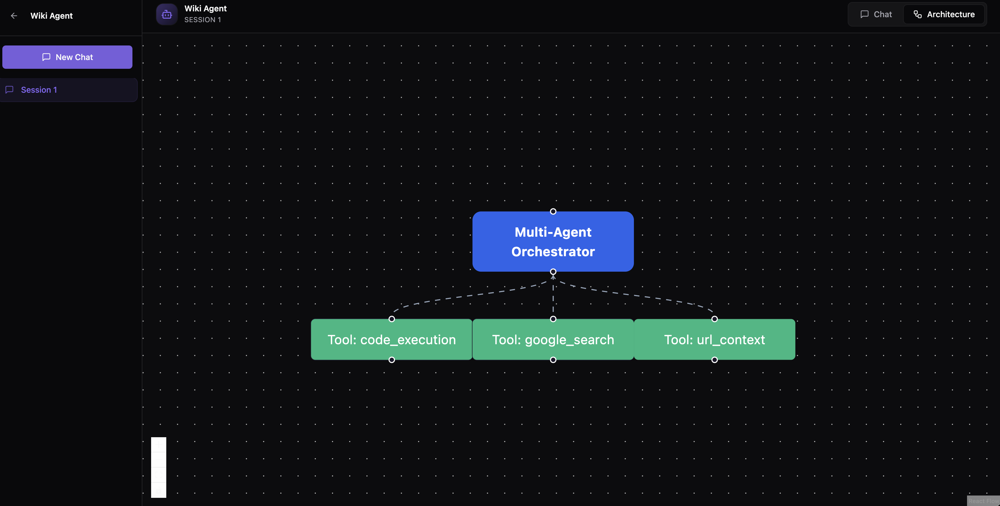

# Nurv

**The PyPI for Agents.**

Nurv is a platform that allows you to build, run, and share serverless AI agents via the Google GenAI Managed Agents API. It enables building and orchestrating reusable Managed Agents entirely via prompts, complete with social features to share and discover agents. It treats agents as modular, reusable components, making it incredibly simple to orchestrate and share complex agentic workflows.

### Screenshots







## 🚀 Key Features

- **Prompt-Based Orchestration:** Build, configure, and orchestrate serverless agents using intuitive natural language prompts without managing complex infrastructure.
- **Advanced Interactions API:** Makes use of the robust Interactions API that natively supports multi-turn conversations, token-by-token streaming, and the ability to easily attach files or external tools.
- **Seamless Integrations:** The Interactions API makes communication between agents, foundational models, and agentic protocols (like Agent-to-Agent or A2A) completely seamless.
- **Socials & Agent Reusability:** Share your agents with other users and groups. Discover and reuse agents created by the community, just like downloading packages from PyPI.
- **Stateful Memory & Chat Sessions:** Multi-turn interactions are persisted remotely in sandbox environments. Create multiple isolated conversation threads (Chat Sessions) per project to maintain deep context across distinct workflows.
- **Premium Dark Mode UI:** A gorgeous, professional dark mode interface featuring glassmorphism, responsive sidebars, interactive citations, and sleek dynamic message bubbles.
- **Real-time Streaming:** Built-in Server-Sent Events (SSE) support for ultra-low latency, token-by-token streaming responses.
- **Automated Logo Generation:** Automatically generates beautiful, scalable vector (SVG) app logos for your agents using Gemini.

## 🏗️ Architecture

Nurv is built using a modern, containerized stack designed for rapid development and deployment:

### Frontend
- **Framework:** React 18 with TypeScript, bundled via Vite.
- **Styling:** TailwindCSS and Shadcn UI for a beautiful, responsive, and accessible interface.
- **Markdown:** Native support for rendering agent responses in Markdown (via `react-markdown` and `remark-gfm`).
- **State Management:** React hooks with localized state, fetching data securely via JWT authentication.

### Backend
- **Framework:** FastAPI (Python 3.11) providing high-performance, asynchronous REST APIs.
- **AI Integration:** Official `google-genai` Python SDK for managing interactions, creating sandboxes, and processing prompts.
- **Database:** SQLite managed via SQLAlchemy ORM, storing user accounts, project configurations, and sandbox environment metadata.
- **Package Management:** `uv` for ultra-fast dependency resolution and isolated virtual environments.

### Orchestration
- **Docker Compose:** The entire stack (frontend and backend) is containerized and orchestrated via `docker-compose.yml`, ensuring a consistent environment across development and production.

## 🛠️ Getting Started

### Prerequisites
- Docker and Docker Compose
- A Google GenAI API Key (`GEMINI_API_KEY`)

### Setup

1. **Environment Variables:**
   Create a `.env` file in the root directory (or update the existing one) with your API key:
   ```env
   GEMINI_API_KEY=your_api_key_here
   ```

2. **Run the Application:**
   Start the stack using Docker Compose:
   ```bash
   docker compose up --build
   ```

3. **Access the App:**
   - Frontend: `http://localhost:5173`
   - Backend API Docs: `http://localhost:8000/docs`

## 🔮 Future Roadmap

- Agent registry for discovering and cloning public agents.
- Advanced A2A (Agent-to-Agent) orchestration pipelines.
